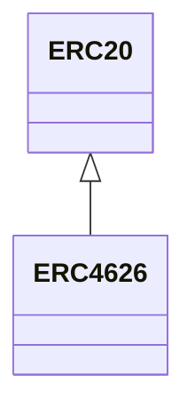
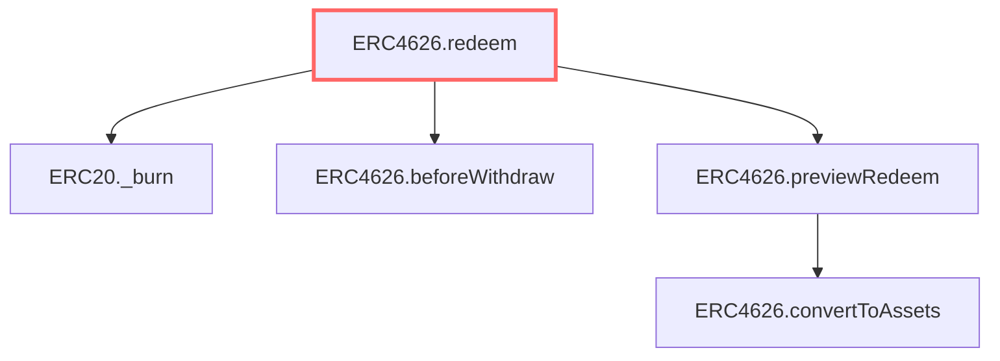

## Overview

ERC4626 is a minimal tokenized Vault implementation (Solmate) that wraps an ERC20 asset into redeemable shares. The contract binds an immutable ERC20 `asset` at construction and sets the ERC20 metadata using the asset's decimals (see constructor, lines 34-40). Deposit/mint and withdraw/redeem flows live in lines 46-116 and use SafeTransferLib for token transfers; afterDeposit and beforeWithdraw hooks at lines 180 and 182 allow custom behavior on deposits/withdrawals.

## Graph context

### Inheritance diagram

### Call graph

### Inheritance

- [[contracts/ERC20|ERC20]]

### Implements

_Implements nothing._

### Uses

- [[libraries/FixedPointMathLib|FixedPointMathLib.mulDivDown]]
- [[libraries/FixedPointMathLib|FixedPointMathLib.mulDivUp]]
- [[libraries/SafeTransferLib|SafeTransferLib.safeTransferFrom]]
- [[libraries/SafeTransferLib|SafeTransferLib.safeTransfer]]

### Callers

_No callers in this graph._

### Callees

_No callees in this graph._

## State

_Trailmark does not extract state variables yet — read the source at `tests/fixtures/tier0_erc4626/src/tokens/ERC4626.sol` lines `10`-`183`._

## Functions

### External

_None._

### Public

- [[contracts/ERC4626|ERC4626.constructor]] `constructor(ERC20 _asset, string _name, string _symbol)` — complexity 1 (callers: 0, callees: 0)
- [[contracts/ERC4626|ERC4626.deposit]] `deposit(uint256 assets, address receiver)` — complexity 1 (callers: 0, callees: 0)
- [[contracts/ERC4626|ERC4626.mint]] `mint(uint256 shares, address receiver)` — complexity 1 (callers: 0, callees: 0)
- [[contracts/ERC4626|ERC4626.withdraw]] `withdraw(uint256 assets, address receiver, address owner)` — complexity 3 (callers: 0, callees: 0)
- [[contracts/ERC4626|ERC4626.redeem]] `redeem(uint256 shares, address receiver, address owner)` — complexity 3 (callers: 0, callees: 0)
- [[contracts/ERC4626|ERC4626.totalAssets]] `totalAssets()` — complexity 1 (callers: 0, callees: 0)
- [[contracts/ERC4626|ERC4626.convertToShares]] `convertToShares(uint256 assets)` — complexity 1 (callers: 0, callees: 0)
- [[contracts/ERC4626|ERC4626.convertToAssets]] `convertToAssets(uint256 shares)` — complexity 1 (callers: 0, callees: 0)
- [[contracts/ERC4626|ERC4626.previewDeposit]] `previewDeposit(uint256 assets)` — complexity 1 (callers: 0, callees: 0)
- [[contracts/ERC4626|ERC4626.previewMint]] `previewMint(uint256 shares)` — complexity 1 (callers: 0, callees: 0)
- [[contracts/ERC4626|ERC4626.previewWithdraw]] `previewWithdraw(uint256 assets)` — complexity 1 (callers: 0, callees: 0)
- [[contracts/ERC4626|ERC4626.previewRedeem]] `previewRedeem(uint256 shares)` — complexity 1 (callers: 0, callees: 0)
- [[contracts/ERC4626|ERC4626.maxDeposit]] `maxDeposit(address)` — complexity 1 (callers: 0, callees: 0)
- [[contracts/ERC4626|ERC4626.maxMint]] `maxMint(address)` — complexity 1 (callers: 0, callees: 0)
- [[contracts/ERC4626|ERC4626.maxWithdraw]] `maxWithdraw(address owner)` — complexity 1 (callers: 0, callees: 0)
- [[contracts/ERC4626|ERC4626.maxRedeem]] `maxRedeem(address owner)` — complexity 1 (callers: 0, callees: 0)

### Internal

- [[contracts/ERC4626|ERC4626.beforeWithdraw]] `beforeWithdraw(uint256 assets, uint256 shares)` — complexity 1 (callers: 0, callees: 0)
- [[contracts/ERC4626|ERC4626.afterDeposit]] `afterDeposit(uint256 assets, uint256 shares)` — complexity 1 (callers: 0, callees: 0)

### Private

_None._

## Events / Errors / Modifiers

_Trailmark does not extract events, errors, or modifiers yet — read the source at `tests/fixtures/tier0_erc4626/src/tokens/ERC4626.sol` lines `10`-`183`._

## Annotations

_No annotations yet._

## Risks

_No risks recorded._
