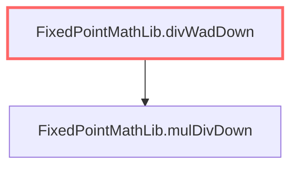

## Overview

FixedPointMathLib is an arithmetic library providing fixed-point operations (WAD = 1e18) used for scaled multiplication, division, exponentiation and square roots. It exposes low-level helpers like mulDivDown/mulDivUp (lines 36-69) that perform checked multiply-and-divide with rounding modes, and convenience WAD wrappers (lines 16-30) for common ETH/ERC20-scaled math. The rpow implementation (lines 71-158) computes x**n with a given scalar using exponentiation by squaring in assembly, and sqrt (lines 164-227) implements an integer square root via the Babylonian method. Many functions use inline assembly and explicitly handle overflow/zero-denominator cases; read the implementations at lines 7-255 for details.

## Graph context

### Inheritance diagram

### Call graph

### Inheritance

_No inheritance edges._

### Implements

_Implements nothing._

### Uses

_No library uses._

### Callers

_No callers in this graph._

### Callees

_No callees in this graph._

## State

_Trailmark does not extract state variables yet — read the source at `tests/fixtures/tier0_erc4626/src/utils/FixedPointMathLib.sol` lines `7`-`255`._

## Functions

### External

_None._

### Public

_None._

### Internal

- [[libraries/FixedPointMathLib|FixedPointMathLib.mulWadDown]] `mulWadDown(uint256 x, uint256 y) returns (uint256)` — complexity 1 (callers: 0, callees: 1)
- [[libraries/FixedPointMathLib|FixedPointMathLib.mulWadUp]] `mulWadUp(uint256 x, uint256 y) returns (uint256)` — complexity 1 (callers: 0, callees: 1)
- [[libraries/FixedPointMathLib|FixedPointMathLib.divWadDown]] `divWadDown(uint256 x, uint256 y) returns (uint256)` — complexity 1 (callers: 1, callees: 1)
- [[libraries/FixedPointMathLib|FixedPointMathLib.divWadUp]] `divWadUp(uint256 x, uint256 y) returns (uint256)` — complexity 1 (callers: 0, callees: 1)
- [[libraries/FixedPointMathLib|FixedPointMathLib.mulDivDown]] `mulDivDown(uint256 x, uint256 y, uint256 denominator) returns (uint256)` — complexity 1 (callers: 2, callees: 0)
- [[libraries/FixedPointMathLib|FixedPointMathLib.mulDivUp]] `mulDivUp(uint256 x, uint256 y, uint256 denominator) returns (uint256)` — complexity 1 (callers: 2, callees: 0)
- [[libraries/FixedPointMathLib|FixedPointMathLib.rpow]] `rpow(uint256 x, uint256 n, uint256 scalar) returns (uint256)` — complexity 1 (callers: 0, callees: 0)
- [[libraries/FixedPointMathLib|FixedPointMathLib.sqrt]] `sqrt(uint256 x) returns (uint256)` — complexity 1 (callers: 0, callees: 0)
- [[libraries/FixedPointMathLib|FixedPointMathLib.unsafeMod]] `unsafeMod(uint256 x, uint256 y) returns (uint256)` — complexity 1 (callers: 0, callees: 0)
- [[libraries/FixedPointMathLib|FixedPointMathLib.unsafeDiv]] `unsafeDiv(uint256 x, uint256 y) returns (uint256)` — complexity 1 (callers: 0, callees: 0)
- [[libraries/FixedPointMathLib|FixedPointMathLib.unsafeDivUp]] `unsafeDivUp(uint256 x, uint256 y) returns (uint256)` — complexity 1 (callers: 0, callees: 0)

### Private

_None._

## Events / Errors / Modifiers

_Trailmark does not extract events, errors, or modifiers yet — read the source at `tests/fixtures/tier0_erc4626/src/utils/FixedPointMathLib.sol` lines `7`-`255`._

## Annotations

_No annotations yet._

## Risks

_No risks recorded._
