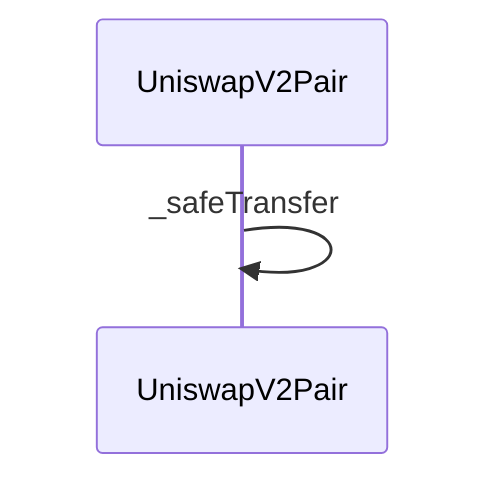
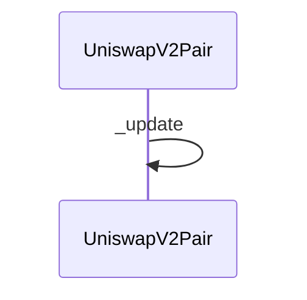

## Overview

swap is the AMM entrypoint that exchanges one input token for another. It validates output amounts (lines 159-162), acquires the lock modifier for reentrancy safety, transfers the requested output to the recipient via _safeTransfer, optionally invokes the recipient's IUniswapV2Callee.uniswapV2Call hook for flash-loan-style callbacks, and finally calls _update to commit new reserves and emit the Swap event (lines 159-200). The constant-product invariant is enforced after the callback returns and balances are sampled, so a callback that fails to repay reverts the entire swap.

## Paths

### Path 1 — swap → _safeTransfer

**Hops:**

1. [[contracts/UniswapV2Pair|UniswapV2Pair.swap]]
2. [[contracts/UniswapV2Pair|UniswapV2Pair._safeTransfer]]

### Path 2 — swap → _update

**Hops:**

1. [[contracts/UniswapV2Pair|UniswapV2Pair.swap]]
2. [[contracts/UniswapV2Pair|UniswapV2Pair._update]]

## Observations

- lock modifier enforces no reentrancy across the swap call
- Swap event emitted after _update commits new reserves
- uniswapV2Call callback executes BEFORE the K-invariant check, so a malicious callback must restore balances
